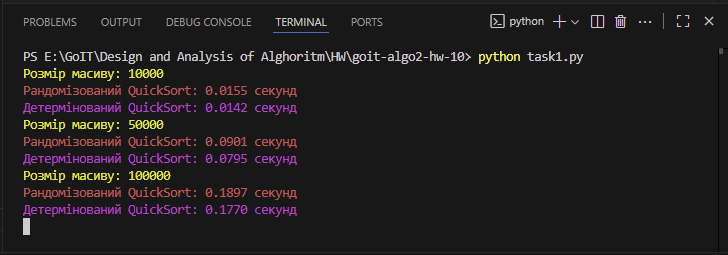
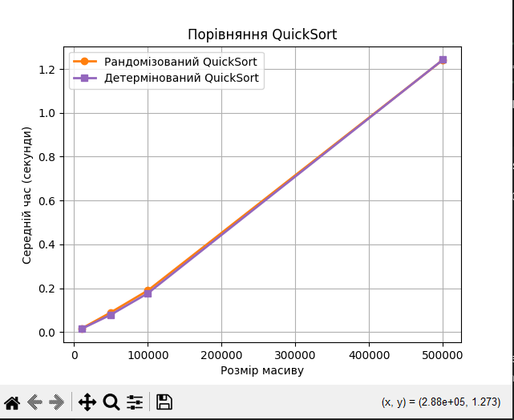
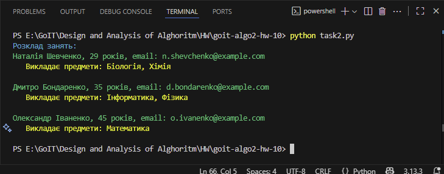

# Домашнє завдання до теми "Алгоритмічна складність, наближені та рандомізовані алгоритми"

Репозиторій містить два незалежні завдання:

## Завдання

- **Порівняння рандомізованого та детермінованого QuickSort**

- **Жадібне складання розкладу занять (Set Cover з пріоритетами)**


---

## Завдання 1

### Вхідні дані

Генеруються випадкові цілі числа в діапазоні [0, 10^6].
Розміри масивів: 10_000, 50_000, 100_000, 500_000.
Для кожного розміру запуск відбувається 5 разів, береться середній час.
Примітка: для чесного порівняння кожна ітерація сортує копію того ж несортованого масиву.

## Запуск
1. Клонуйте репозиторій git clone https://github.com/nata87/goit-algo2-hw-10
2. У терміналі виконайте:

```bash
python task1.py
```
---

## Результат 




---

## Завдання 2

### Вхідні дані
{'Математика', 'Фізика', 'Хімія', 'Інформатика', 'Біологія'}

Викладачі:
Олександр Іваненко, 45 років, o.ivanenko@example.com, предмети: {Математика, Фізика}
Марія Петренко, 38 років, m.petrenko@example.com, предмети: {Хімія}
Сергій Коваленко, 50 років, s.kovalenko@example.com, предмети: {Інформатика, Математика}
Наталія Шевченко, 29 років, n.shevchenko@example.com, предмети: {Біологія, Хімія}
Дмитро Бондаренко, 35 років, d.bondarenko@example.com, предмети: {Фізика, Інформатика}
Олена Гриценко, 42 роки, o.grytsenko@example.com, предмети: {Біологія}

## Запуск
1. Клонуйте репозиторій git clone https://github.com/nata87/goit-algo2-hw-10
2. У терміналі виконайте:

```bash
python task2.py
```
---

## Результат 

